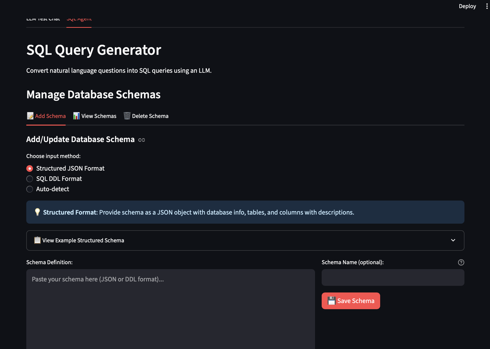

# AIToolbox
An extensible web application centralizing AI-powered, low-code tools like SQL query generation and document RAG. Built with Streamlit and Python, it seamlessly integrates various LLM APIs and local models for enhanced productivity.

---

### Key Features

* **RAG-powered SQL Generation**: Uses semantic search to retrieve relevant schema fragments based on a user's question, providing the LLM with a focused context to generate precise SQL queries.
* **Flexible LLM Integration**: Supports multiple LLM providers for both embeddings and query generation, including **OpenAI**, **Google Gemini**, **Ollama**, and **local Sentence Transformers** models.
* **Persistent Schema Management**: The application can ingest new database schemas (via DDL definitions), store them persistently, and generate a searchable vector index.
* **Modular Architecture**: The codebase is separated into distinct components for LLM interaction, vector database management, and SQL agent logic, making it easy to understand and extend.
* **Streamlit UI**: A user-friendly web interface for managing schemas and generating SQL queries.

---

### Core Concepts: How It Works

The system operates on a retrieval-augmented generation pipeline to ensure high-quality output while managing context window limitations.

1.  **Schema Ingestion**: When a new schema (e.g., a `CREATE TABLE` statement) is added, it is parsed into individual fragments (e.g., table definitions). Each fragment is then converted into a numerical vector embedding and stored in a local vector database (FAISS).
2.  **Query Embedding**: When a user asks a natural language question, the system generates a vector embedding for the question.
3.  **Relevant Schema Retrieval**: The question's embedding is used to perform a semantic search against the stored schema embeddings. The most relevant schema fragments are retrieved.
4.  **Prompt Construction**: A dynamic prompt is constructed for the LLM. It includes the original question and only the relevant schema fragments retrieved in the previous step.
5.  **SQL Generation**: The LLM processes the focused prompt and generates the final SQL query.
6.  **Output**: The generated SQL is presented to the user.

---

### Project Structure

* `src/aitoolkit/backend/agents/sql_agent.py`: The main logic for the SQL agent. This orchestrates the entire process, from embedding the question to generating the final SQL.
* `src/aitoolkit/backend/db/schema_manager.py`: Manages the database schemas, including loading/saving them and generating/updating their embeddings.
* `src/aitoolkit/backend/db/vector_db_manager.py`: An abstraction layer for the vector database, with a concrete implementation using **FAISS**. Handles document addition and semantic search.
* `src/aitoolkit/backend/llm/embedding.py`: Defines the `EmbeddingLLM` interface and provides concrete implementations for various providers.
* `src/aitoolkit/backend/llm/__init__.py`: (Assumed) Contains the LLM implementations for text generation.
* `streamlit_app.py`: The Streamlit frontend that ties all the backend components together and provides the user interface.

---

### UI

Here are a few screenshots of the application's user interface.

* **AIToolbox Home**: The main dashboard showing the different tools available in the application.
    

* **Change Options**: The sidebar where users can change the LLM models and other settings.
    

* **ChatLLM Interface**: The general chat interface for interacting with the LLM.
    

* **SQL Agent**: The core UI for the SQL agent where users input natural language questions.
    

* **Schema Management**: The interface for adding, selecting, and managing database schemas.
    


---

### Setup and Installation

#### Prerequisites
* Python 3.8+
* A working internet connection for API-based LLMs.
* (Optional) If using the Ollama model, you must have an Ollama server running locally with the desired model pulled.

#### Installation Steps

1.  **Clone the repository:**
    ```bash
    git clone [https://github.com/SunnyRaj94/AIToolbox.git](https://github.com/SunnyRaj94/AIToolbox.git)
    cd AIToolbox
    ```

2.  **Install dependencies using Poetry (recommended) or pip:**
    ```bash
    # Using Poetry
    poetry install

    # Or using pip
    pip install -r requirements.txt
    ```
    *Note: The project requires `faiss-cpu`, `langchain-community`, and the specific LLM client libraries (e.g., `openai`, `google-generativeai`).*

3.  **Create a configuration file:**
    Create a `config.py` file in the root directory (or as required by your project structure) to define paths and settings.

    ```python
    # config.py
    import os
    
    configs = {
        'sql_agent_settings': {
            'default_prompt_template': 'prompts/sql_agent_template.txt'
        }
    }
    ```
    You will also need a `prompts/sql_agent_template.txt` file.

4.  **Set up API Keys (if needed):**
    If you plan to use OpenAI or Google Gemini, set your API keys as environment variables.

    ```bash
    export OPENAI_API_KEY="your-openai-api-key"
    export GOOGLE_GEMINI_API_KEY="your-google-gemini-api-key"
    ```

---

### Usage

To run the Streamlit application, execute the following command from the root of the project directory:

```bash
streamlit run streamlit_app.py
```

This will launch the app in your web browser, where you can:
1.  Select your desired LLM models for embeddings and generation.
2.  Add a new database schema by providing a name and a DDL definition.
3.  Select an existing schema to query.
4.  Enter your natural language question and generate a SQL query.

---

### Customization

* **Change LLM Models**: You can change the default LLM models by modifying the `streamlit_app.py` file. The `EMBEDDING_LLM_REGISTRY` and your generative LLM initialization logic make it easy to swap providers.
* **Update Prompt Template**: Modify the `prompts/sql_agent_template.txt` file to adjust the instructions given to the LLM. This is where you can add few-shot examples or change the desired output format.
* **Change Vector Database**: To use a different vector database (e.g., Chroma, Pinecone), you would create a new class that inherits from `BaseVectorDBManager` and update the `FAISSVectorDBManager` instantiation in `streamlit_app.py`.

---

### License

This project is licensed under the MIT License.
